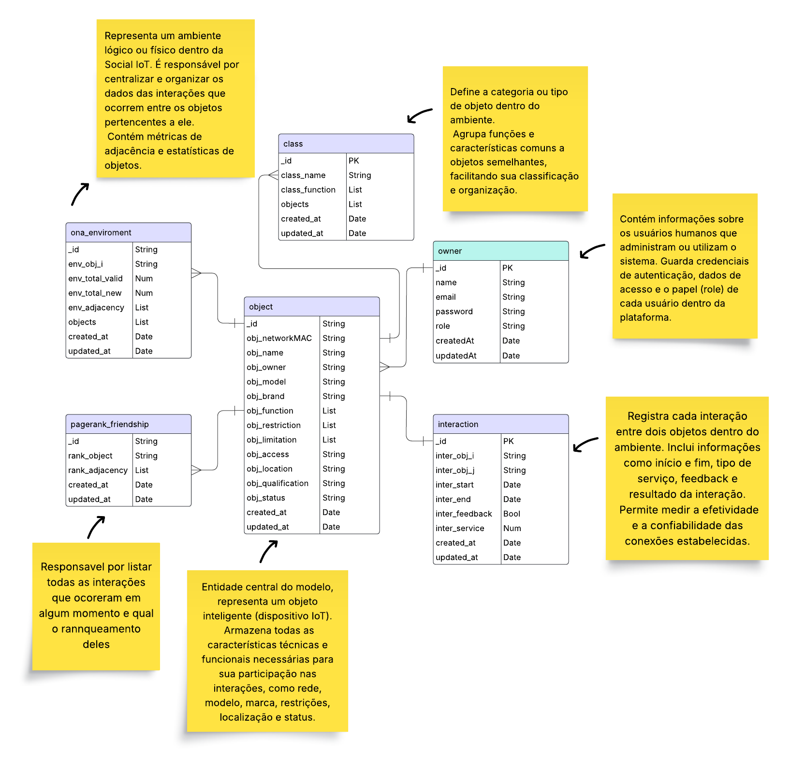

# VISO-B.A.S.S. 🛰️

VISO-B.A.S.S. — VISO-Based API for Structured Storage
Uma API projetada para armazenamento estruturado e eficiente de dados no contexto da Social IoT, implementada com NestJS e MongoDB.

O sistema adota a abordagem estrutural do modelo [VISO](https://sol.sbc.org.br/index.php/semish/article/view/25072), garantindo organização, escalabilidade e consultas otimizadas para informações relacionadas a objetos, classes, interações, ambientes e relações sociais.

Este projeto integra a pesquisa de mestrado realizada na Universidade Federal de Pelotas (UFPEL), intitulada:
"VISO-BASS: Uma Proposta Estrutural para Persistência de Dados na Social IoT".

[](https://nestjs.com/)
[](https://www.mongodb.com/)
[](https://www.typescriptlang.org/)
[](https://www.docker.com/)
[](https://render.com/)
[](LICENSE)
[](https://github.com/Grazziano/VISO-BASS/commits/main)
[](https://github.com/Grazziano/VISO-BASS/issues)

<!-- > **API desenvolvida com NestJS e MongoDB para persistência de dados no contexto da Social IoT**, seguindo a proposta estrutural da abordagem **VISO**.  
> Parte da pesquisa de mestrado: **"VISO-BASS: Uma Proposta Estrutural para Persistência de Dados na Social IoT"**. -->

---

## 📸 Demonstração

  
<!-- <sub>*Api rodando*</sub> -->

---

## 📌 Status do Projeto

| Status Geral      | API | Banco de Dados | Documentação | Testes |
|-------------------|-----|---------------|--------------|--------|
| 🚀 Em desenvolvimento | 🛠️ Em andamento | ✅ Concluído | 🛠️ Em andamento | 🛠️ Em andamento |

---

## 🚀 Tecnologias Utilizadas

- [NestJS](https://nestjs.com/) — Framework Node.js para construção de APIs escaláveis
- [MongoDB](https://www.mongodb.com/) — Banco de dados NoSQL
- [Mongoose](https://mongoosejs.com/) — ODM para modelagem de dados
- [TypeScript](https://www.typescriptlang.org/) — Linguagem tipada para JavaScript
- [Dotenv](https://github.com/motdotla/dotenv) — Variáveis de ambiente
- [Docker](https://www.docker.com/) — Plataforma de contêineres para isolamento e padronização de ambientes de desenvolvimento
- [Render](https://render.com/) — Plataforma de hospedagem de aplicações na nuvem

---

## 📂 Estrutura do Projeto

```bash
docs/                        # Arquivos de documentação, imagens, GIFs e guias adicionais
src/                         # Código-fonte principal da aplicação
├── modules/                 # Módulos da aplicação
│   ├── auth/
│   ├── common/              # Utilitários e middlewares
│   │   └── filters/         # Filtros de exceção global
│   ├── database/
│   │   └── seeders/         # Dados iniciais para popular o banco
│   ├── interaction/
│   ├── ona-enviroment/
│   ├── owners/
│   ├── pagerank-friendship/
│   ├── viso-class/
│   └── viso-object/
├── app.controller.ts        # Controller raiz
├── app.module.ts            # Módulo raiz
├── app.service.ts           # Service raiz
└── main.ts                  # Ponto de entrada da aplicação
test/                        # Testes unitários
.env.example                 # Exemplo de variáveis de ambiente necessárias para rodar o projeto
.gitignore                   # Arquivos e pastas a serem ignorados pelo Git
docker-compose.yml           # Configuração Docker Compose para rodar API + MongoDB + Mongo Express
Dockerfile                   # Instruções para criar a imagem Docker da API
````

---

## 🗄️ Modelo de Dados (MongoDB)

O diagrama abaixo representa a modelagem utilizada no projeto, destacando as entidades, suas relações e como elas são persistidas no **MongoDB**.

<p align="center">
  
</p>

> O diagrama foi gerado a partir do modelo conceitual e traduzido para schemas do **Mongoose/NestJS**.

---

## ⚙️ Pré-requisitos

* [Node.js](https://nodejs.org/) **>= 18**
* [MongoDB](https://www.mongodb.com/) ou [MongoDB Atlas](https://www.mongodb.com/cloud/atlas)
* [Git](https://git-scm.com/)

---

## 📥 Instalação

```bash
# Clonar o repositório
git clone https://github.com/Grazziano/VISO-BASS.git

# Acessar o diretório
cd VISO-BASS

# Instalar dependências
npm install
```

---

## 🔑 Configuração

Crie um arquivo **`.env`** na raiz do projeto ou renomeie o arquivo **`.env.example`**:

```env
MONGO_URI=mongodb://localhost:27017/viso-bass
PORT=3000
JWT_SECRET=sua_chave_secreta_aqui
JWT_EXPIRES_IN=24h
```

Para usar no **MongoDB Atlas**:

```env
MONGO_URI=mongodb+srv://<usuario>:<senha>@<cluster>.mongodb.net/viso-bass
PORT=3000
JWT_SECRET=sua_chave_secreta_aqui
JWT_EXPIRES_IN=24h
```

---

## ▶️ Executando a Aplicação

```bash
# Ambiente de desenvolvimento
npm run start:dev

# Produção
npm run build
npm run start:prod
```

Acesse:

```
http://localhost:3000
```

---

## 🐳 Rodando com Docker

O projeto possui um **ambiente completo via Docker Compose**, incluindo:

* **API NestJS** (porta `3000`)
* **MongoDB** (porta `27017`)
* **Mongo Express** – interface web para o banco (porta `8081`)

---

### 📋 Pré-requisitos

* [Docker](https://www.docker.com/get-started) instalado
* [Docker Compose](https://docs.docker.com/compose/) instalado

---

### ⚙️ Configuração do `.env` para Docker

No arquivo `.env` na raiz do projeto, defina:

```env
MONGO_URI=mongodb://mongo:27017/viso-bass
PORT=3000
JWT_SECRET=sua_chave_secreta_aqui
JWT_EXPIRES_IN=24h
```

> Importante: o host do Mongo é `mongo`, que é o nome do serviço no `docker-compose.yml`.

---

### 🚀 Subindo o ambiente

```bash
docker-compose up --build
```

Após a inicialização:

* **API:** [http://localhost:3000](http://localhost:3000)
* **Mongo Express:** [http://localhost:8081](http://localhost:8081)

  * Usuário: `admin`
  * Senha: `admin`

---

### 📦 Parando os containers

```bash
docker-compose down
```

Para também remover os dados persistidos no banco:

```bash
docker-compose down -v
```

---

### 💡 Dicas

* O Mongo Express é útil para **visualizar coleções, inserir, editar e excluir documentos** diretamente via navegador.
* As alterações feitas no Mongo Express são refletidas imediatamente na API.
* O volume `mongo_data` garante que os dados do banco persistam mesmo que os containers sejam reiniciados.

---

## 🌐 Aplicação em Deploy

A aplicação está disponível em produção no seguinte endereço:

**🔗 URL de Produção:** [https://viso-bass.onrender.com](https://viso-bass.onrender.com)

### 📋 Status do Deploy

[](https://viso-bass.onrender.com)
<!-- [](https://viso-bass.onrender.com) -->

### ⚠️ Importante sobre o Deploy

- O deploy é realizado automaticamente via **Render** quando há pushes para a branch `main`
- O banco de dados utilizado é o **MongoDB Atlas** (nuvem)
- A aplicação pode entrar em modo de hibernação após períodos de inatividade (política gratuita do Render)
- O primeiro acesso após hibernação pode demorar alguns segundos para "acordar" a aplicação

---

## 🌱 Rodando os Seeders (Populando o Banco)

O projeto conta com **seeders** para popular o banco de dados com dados iniciais de usuários, objetos, classes, interações, ambientes e relações sociais.

### ▶️ Executando manualmente

```bash
# Rodar todos os seeders
npm run seed
````

### 💡 Observações

* Certifique-se de que o **MongoDB** está rodando e que o arquivo `.env` contém a variável `MONGO_URI` configurada corretamente.
* Caso use **Docker**, suba os containers antes de executar os seeders:

```bash
docker-compose up -d
npm run seed
```

---

## 📚 Endpoints Principais

### 🔓 Rotas Públicas (sem autenticação)

| Método | Rota                                       | Descrição                                          |
| ------ | ------------------------------------------ | -------------------------------------------------- |
| GET    | /api                                       | Lista todos os endpoints                           |
| POST   | /auth/register                             | Cria um novo usuário                               |
| POST   | /auth/login                                | Efetua login                                       |

### 🔐 Rotas Protegidas (requer autenticação)

| Método | Rota                                       | Descrição                                          |
| ------ | ------------------------------------------ | -------------------------------------------------- |
| GET    | /auth/me                                   | Retorna dados do usuário                           |
| GET    | /object                                    | Lista todos os objetos                             |
| GET    | /object/:id                                | Encontra objeto pelo id                            |
| POST   | /object                                    | Cria um novo objeto                                |
| GET    | /class                                     | Lista todas as classes                             |
| GET    | /class/:id                                 | Encontra classe pelo id                            |
| POST   | /class                                     | Cria uma nova classe                               |
| GET    | /interaction                               | Lista todas as interações                          |
| GET    | /interaction/time-series                   | Lista interações em série temporal (para gráficos) |
| GET    | /interaction/count-by-day                  | Lista interações por mes/dia                       |
| GET    | /interaction/:id                           | Encontra interações por id                         |
| POST   | /interaction                               | Cria uma nova interação                            |
| GET    | /ona-enviroment                            | Lista todos os ambientes                           |
| GET    | /ona-enviroment/:id                        | Encontra ambiente por id                           |
| POST   | /ona-enviroment                            | Cria um novo ambiente                              |
| GET    | /pagerank-friendship                       | Lista relações de amizade                          |
| GET    | /pagerank-friendship/:id                   | Encontra amizade por id                            |
| POST   | /pagerank-friendship                       | Cria uma relação de amizade                        |
| GET    | /pagerank-friendship/relevant?limit=10     | Lista as relações mais relevantes                  |

---

## 🧪 Testes

```bash
# Unit tests
npm run test

# E2E tests
npm run test:e2e

# Cobertura
npm run test:cov
```

---

## 📄 Licença

Distribuído sob a licença MIT. Veja [LICENSE](LICENSE) para mais informações.

---

## 🔗 Links

* **Repositório:** [VISO-BASS no GitHub](https://github.com/Grazziano/VISO-BASS)
* **Outros Projetos relacionados:** [Repositórios de Pesquisa - UFPel](https://github.com/Grazziano/projetos-siot)
* **NestJS:** [Documentação Oficial](https://docs.nestjs.com/)
* **MongoDB:** [Documentação Oficial](https://www.mongodb.com/docs/)


## 🌟 Contato & Suporte

**Precisa de ajuda ou quer colaborar?** Estou disponível para trocar ideias e parcerias!

📬 **Meios de contato:**
- [LinkedIn](https://www.linkedin.com/in/grazziano-fagundes/)

---

<div align="center">
  <sub>Desenvolvido com ❤️ por <a href="https://github.com/Grazziano">Grazziano Borges Fagundes</a></sub><br>
  <sub>© 2025 - Todos os direitos reservados</sub>
</div>
